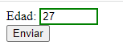
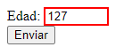

# Ejercicio input-css

1. Define un input de tipo numérico que nos permita solamente introducir la edad de una
persona con un rango del 0 al 120.

2. Crea label y asóciala a dicho input.

3. Define dos reglas CSS una para cuando el valor del input se haya introducido
correctamente y otra para cuando se haya introducido incorrectamente.

>Como podemos comprobar el ejercicio se ha hecho correctamente:
> 